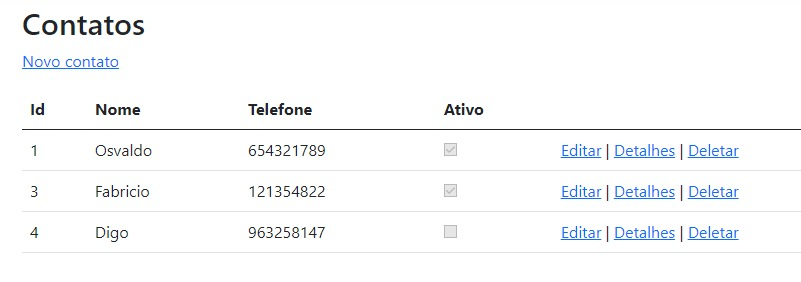
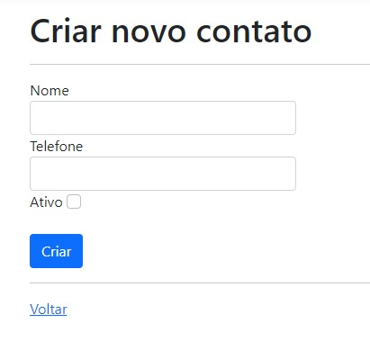
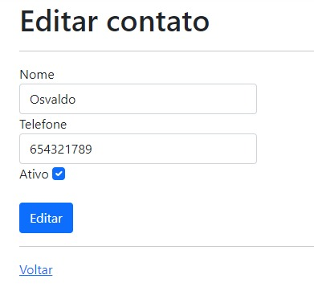
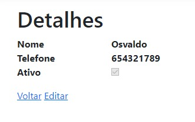
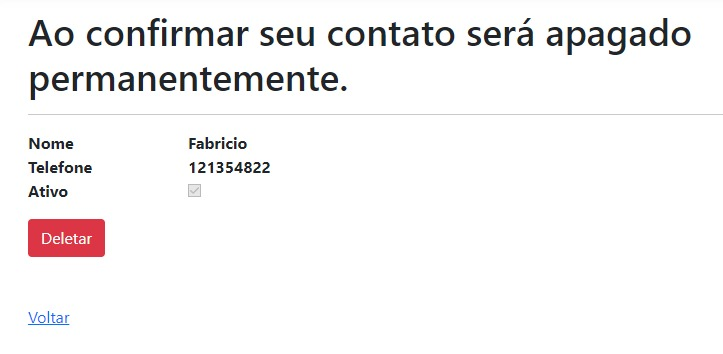

<body>
    <h1 align="center">Página criada como estudo em MVC</h1>
    
Utilizando a linguagem de programção C#, banco de dados Mysql e o EntityFrameowrk.

    
O projeto consiste em praticar o estudo do CRUD em um projeto real.

    <h2>Contatos</h2>
    
A página de contatos faz uma busca pelo banco de dados e disponibiliza todos os contatos cadastrados de acordo co o ID.

    
    
Na página de Contatos, é possível ser redirecionado para inserir novo contato, editar contato já existente, visualizar contato ou deletar o contato.

    <h2>Inserir</h2>
    
    
Clicando na label "novo contato" na página de contatos. A página é redirecionada para o formulário de criação de contato novo.

    <h2>Editar</h2>
    
    
Clicando em editar, o usuário é redirecionado para que possa alterar as informações do contato desejado.

    <h2>Detalhes</h2>
    
    
Área para ter melhor visibilidade do contato. Caso haja alguma atualização e possa insrir mais informações do contato poderia ser visualizada nesta página.

    <h2>Deletar</h2>
    
    
Caso algum contato deixe de exister ou precise ser completamente removido é possível clicando em deletar na página contatos. O cliente será redireciondo e questionado mais uma vez se realmente deseja remover aquele contato.

</body>